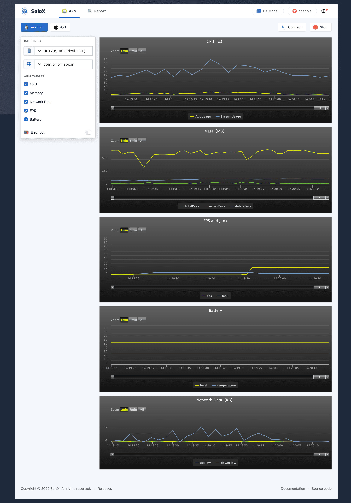

<p align="center">
  <a>README</a> | <a href="./DocForAndroid.md">DocForAndroid</a>
</p>

<p align="center">
<a href="#">

</a>
<br>
<br>
</p>
<p align="center">
<a href="https://pypi.org/project/solox/" target="__blank"></a>
<br>
</p>

## Preview

SoloX - Real-time collection tool for Android/iOS performance data.

We are committed to solving inefficient, cumbersome test execution, and our goal is Simple Test In SoloX!



## Installation
```
1.Python:3.6+ 
2.pip3 install -U solox
```

## Startup SoloX
### default
```shell
python3 -m solox
```
### customize

```shell
python3 -m solox --host=0.0.0.0 --port=50003
```

## Collect in python 
```python
from solox.public.apm import APM

apm = APM(pkgName='com.bilibili.app.in',deviceId='ca6bd5a5',platform='Android')
# apm = APM(pkgName='com.bilibili.app.in', platform='iOS') only support one device
cpu = apm.collectCpu() # %
memory = apm.collectMemory() # MB
flow = apm.collectFlow() # KB
fps = apm.collectFps() # HZ
battery = apm.collectBattery() # level:% temperature:°C

```
## Thanks
- https://github.com/alibaba/mobileperf

- https://github.com/alibaba/taobao-iphone-device

## Communicate
- QQ: 1501556640
- Gmail: rafacheninc@gmail.com

