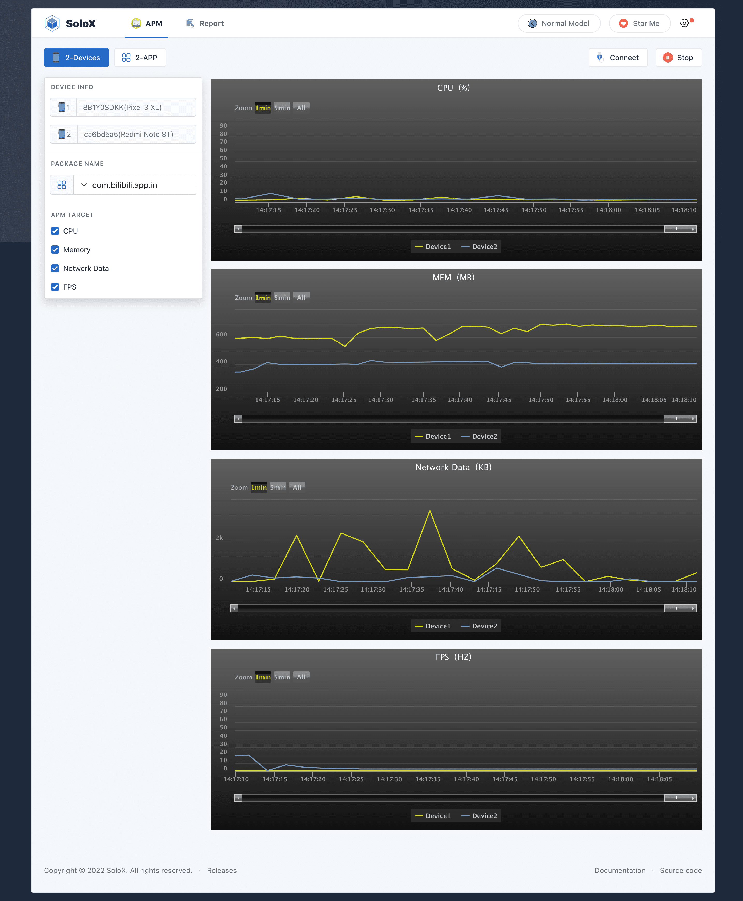

<p align="center">
  <a>中文</a> | <a href="./README.md">English</a> | <a href="./DocForAndroid.md">DocForAndroid</a>
</p>

<p align="center">
<a href="#">

</a>
<br>
<br>

</p>
<p align="center">
<a href="https://pypi.org/project/solox/" target="__blank"></a>
<a href="https://pypistats.org/packages/solox" target="__blank"></a>

<br>
</p>

## 简介

SoloX - Android/iOS性能数据实时采集工具。

我们致力于解决低效、繁琐的测试执行，我们的目标是【Simple Test in SoloX】


## 安装
```
1.Python:3.6+ 
2.pip3 install -U solox

注意: 如果Windows用户需要测试ios，先安装并启动iTunes
```

## 启动SoloX
### 默认
```shell
python3 -m solox
```
### 自定义

```shell
python3 -m solox --host=0.0.0.0 --port=50003
```

## 使用python收集
```python
from solox.public.apm import APM
# solox version >= 2.1.2

apm = APM(pkgName='com.bilibili.app.in',deviceId='ca6bd5a5',platform='Android')
# apm = APM(pkgName='com.bilibili.app.in', platform='iOS') only supports one device
cpu = apm.collectCpu() # %
memory = apm.collectMemory() # MB
flow = apm.collectFlow() # KB
fps = apm.collectFps() # HZ
battery = apm.collectBattery() # level:% temperature:°C
```

## 使用api收集 
### 1.后台启动服务

```
# solox version >= 2.1.5

macOS/Linux: nohup python3 -m solox &
Windows: start /min python3 -m solox &
```

### 2.通过api请求性能数据
```
http://{ip}:50003/apm/collect?platform=Android&deviceid=ca6bd5a5&pkgname=com.bilibili.app.in&apm_type=cpu

apm_type in ['cpu','memory','network','fps','battery']
```

## 对比模式
- 2-devices: 在两部不同的手机上测试同一个应用
- 2-apps: 在具有相同配置的两部手机上测试两个不同的应用程序




## 感谢

- https://github.com/alibaba/taobao-iphone-device

## 交流
- Gmail: rafacheninc@gmail.com

## 捐赠


